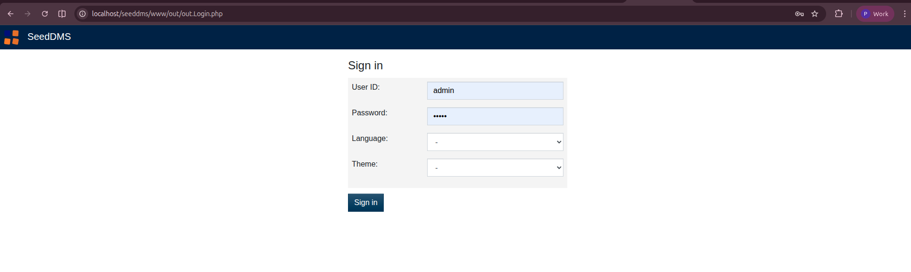
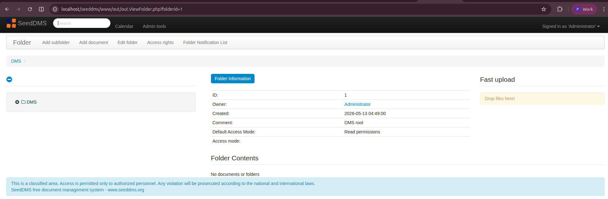
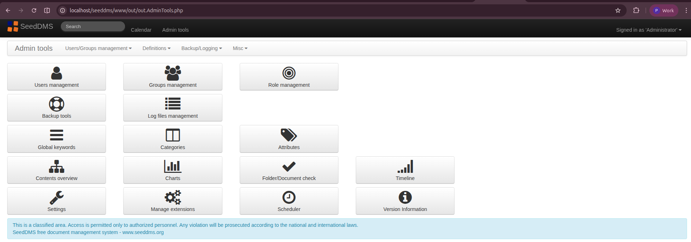

# 📁 SeedDMS — Hostinger Deployment Guide

> A practical deployment, upgrade, and maintenance guide for hosting **SeedDMS** (Open Source Document Management System) on **Hostinger Shared Hosting** with **Cloudflare** integration.

> 📸 All screenshots in this repository are captured from a local Ubuntu-based testing environment and are used for demonstration purposes.
---
## 📸 Screenshots

<p align="center">
  
  
  
</p>
<hr>

## 🧩 Project Overview

This repository documents the end-to-end process of researching, deploying, customizing, upgrading, and maintaining an open-source Document Management System (DMS) for internal organizational use.

The objective was to build a centralized document management solution that could be hosted on shared hosting infrastructure while remaining cost-effective, secure, and easy to maintain.

SeedDMS was deployed on Hostinger Shared Hosting as a centralized document management solution for internal organizational use.

---

## 🔍 Why SeedDMS?

SeedDMS was chosen because it provides:

- Role-based access control (ACL)
- Document versioning
- Full-text search support
- Active open-source community
- Modern and clean interface
- Easy deployment on shared hosting

---

## 🛠️ Tech Stack

| Component | Details |
|---|---|
| **Application** | SeedDMS 6.0.39 |
| **Language** | PHP 8.2 |
| **Database** | MySQL |
| **Hosting** | Hostinger Shared Hosting |
| **DNS & Security** | Cloudflare |
| **Access Methods** | SSH + hPanel File Manager |
| **Web Server** | Apache (.htaccess rewrite rules) |

---

## 📌 What Was Done

- ✅ Researched and evaluated open-source DMS platforms
- ✅ Presented deployment recommendation with technical justification
- ✅ Coordinated hosting and domain setup
- ✅ Deployed SeedDMS on Hostinger Shared Hosting using SSH
- ✅ Configured MySQL database connectivity
- ✅ Implemented Apache rewrite rules for clean URL routing
- ✅ Applied custom branding and UI customization
- ✅ Integrated Cloudflare for DNS management and security
- ✅ Configured firewall/security rules to reduce automated bot traffic
- ✅ Performed version upgrades (6.0.33 → 6.0.39)
- ✅ Created installation, upgrade, and troubleshooting documentation
- ✅ Documented rollback and upgrade procedures

---

## 📂 Repository Scope

This repository does **not** contain the SeedDMS source code.

It contains:

- Deployment documentation
- Upgrade procedures
- Troubleshooting guides
- Operational notes
- Configuration guidance
- Practical deployment experience

---

## 📚 Documentation

| Document | Description |
|---|---|
| [Installation Guide](docs/installation.md) | First-time SeedDMS setup on Hostinger |
| [Upgrade Guide](docs/upgrade.md) | Step-by-step upgrade procedure |
| [Troubleshooting Guide](docs/troubleshooting.md) | Common issues and fixes |

---

## 🚀 Key Highlights

### 🔐 Cloudflare Integration

After observing unusually high automated traffic, Cloudflare was integrated to:

- Manage DNS records
- Reduce malicious bot traffic
- Improve security posture
- Add an additional protection layer

---

### 🎨 Custom Branding

The deployment includes custom branding changes:

- Custom logo integration
- UI text customization
- Modified language labels

Example paths used:

```text
i) seeddms-6.0.x/views/bootstrap/images/
ii) seeddms-6.0.x/languages/en_GB/lang.inc
```

---

## 🔄 Upgrade Strategy

Before applying updates to the live site, the new SeedDMS version was first tested inside a temporary subfolder (`n/`).

The upgrade process included:

1. Uploading and configuring the new version inside `n/`
2. Running the required upgrade/migration steps
3. Testing login, documents, charts, and customizations
4. Moving the updated version live after successful testing
5. Keeping backup files available for rollback if needed

Detailed upgrade steps are available in: [Upgrade Guide](docs/upgrade.md)


---

## 📅 Project Timeline

| Phase | Period |
|---|---|
| Research & Evaluation | 2025 |
| Initial Deployment | 2025 |
| Cloudflare Integration & Hardening | 2025 |
| Version Upgrade & Maintenance | 2025–2026 |
| Documentation & Repository Creation | 2026 |

---

## 🧪 Tested Environment

- Hostinger Shared Hosting
- PHP 8.2
- MySQL
- Apache
- Cloudflare Enabled
- SeedDMS 6.0.39

---
## 📖 Key Learnings

This project provided hands-on experience with:

- Deploying and maintaining a PHP-based application on shared hosting
- Handling shared hosting limitations such as broken symlinks and archive extraction issues
- Learned safe upgrade testing practices using a temporary subfolder before live deployment
- Performing safe rollback procedures during upgrade testing
- Configuring Apache rewrite rules and application paths
- Troubleshooting real deployment issues including HTTP 500 errors, missing dependencies, and caching problems
- Using Cloudflare for DNS management, bot traffic reduction, and basic security hardening
- Creating operational documentation for installation, upgrades, and troubleshooting
---

## 👤 Author

**Parmeshwar**  
GitHub: [@MrParmeshwar](https://github.com/MrParmeshwar)

---

## 📜 License

This repository contains deployment and operational documentation created by the author and is licensed under the MIT License.

SeedDMS is a separate open-source project licensed under GPLv2.

For official SeedDMS information, visit: [seeddms.org](https://www.seeddms.org)
